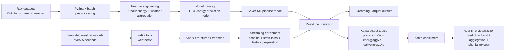
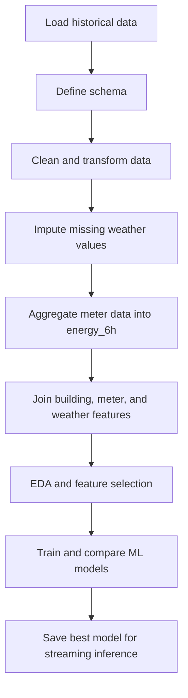
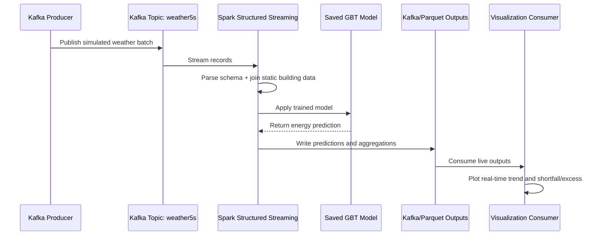

# Building Energy Prediction and Real-Time Streaming Portfolio

## Executive Summary

This portfolio demonstrates an end-to-end big data pipeline for building energy analytics. The project starts with batch preprocessing using PySpark to clean, join, and transform building, meter, and weather datasets into six-hour energy features. A Gradient-Boosted Tree model is then trained to predict building energy consumption and evaluated against alternative approaches. The real-time section simulates weather data production using Kafka, ingests the stream with Spark Structured Streaming, enriches it with static building metadata, applies the trained model, and writes prediction outputs to Parquet and Kafka topics. Finally, Kafka consumers visualize live prediction trends, energy aggregation, and daily shortfall or excess energy. Overall, it shows practical capability in PySpark, Kafka, streaming architecture, machine learning, and real-time operational monitoring.

## End-to-End Big Data and Real-Time Architecture



## Batch Processing and Model Development



## Real-Time Streaming and Visualization



## Files Structure

```text
building-energy-realtime-portfolio/
├── README.md
├── LICENSE
├── .gitignore
├── requirements.txt
├── notebooks/
│   ├── 01_data_preprocessing.ipynb
│   ├── 02_building_energy_prediction_model.ipynb
│   ├── 03a_produce_streaming_data.ipynb
│   ├── 03b_stream_predict_realtime_data.ipynb
│   └── 03c_realtime_visualization.ipynb
├── docs/
│   ├── index.html
│   ├── .nojekyll
│   └── notebooks/
│       ├── 01_data_preprocessing.html
│       ├── 02_building_energy_prediction_model.html
│       ├── 03a_produce_streaming_data.html
│       ├── 03b_stream_predict_realtime_data.html
│       └── 03c_realtime_visualization.html
├── src/
├── data/
├── models/
├── outputs/
└── checkpoints/
```

## Project Components

| Step | Notebook | Purpose | Portfolio View |
|---|---|---|---|
| 1 | `01_data_preprocessing.ipynb` | Batch preprocessing and Spark-based analysis | `docs/notebooks/01_data_preprocessing.html` |
| 2 | `02_building_energy_prediction_model.ipynb` | Feature engineering, EDA, model training, and evaluation | `docs/notebooks/02_building_energy_prediction_model.html` |
| 3A | `03a_produce_streaming_data.ipynb` | Simulate and publish weather records to Kafka | `docs/notebooks/03a_produce_streaming_data.html` |
| 3B | `03b_stream_predict_realtime_data.ipynb` | Consume Kafka stream, process features, predict, and output streams | `docs/notebooks/03b_stream_predict_realtime_data.html` |
| 3C | `03c_realtime_visualization.ipynb` | Consume prediction topics and visualize results in real time | `docs/notebooks/03c_realtime_visualization.html` |

## Tech Stack

Python · PySpark · Spark SQL · Spark Structured Streaming · Kafka · Machine Learning · Parquet · 
